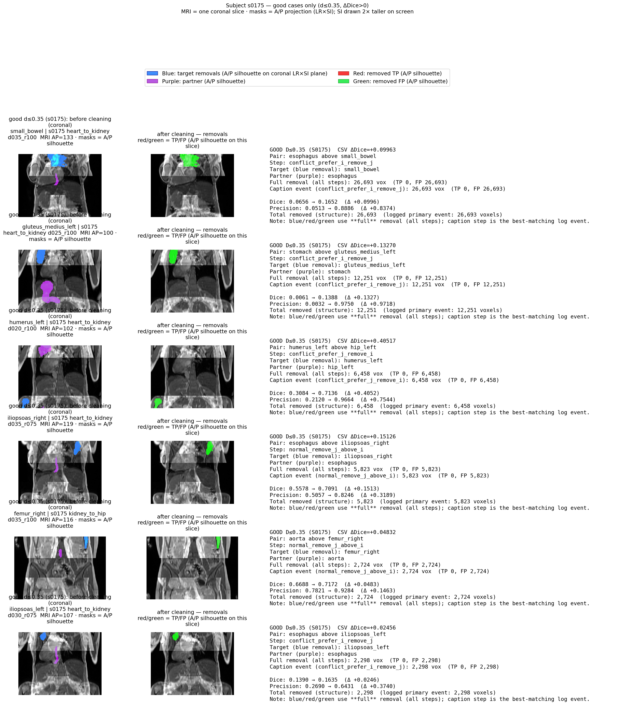
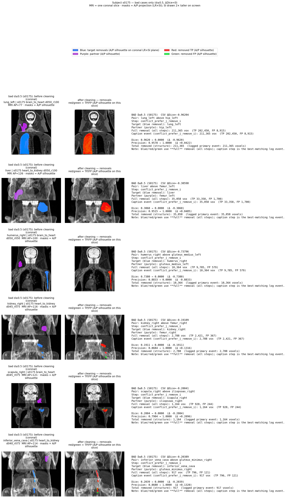
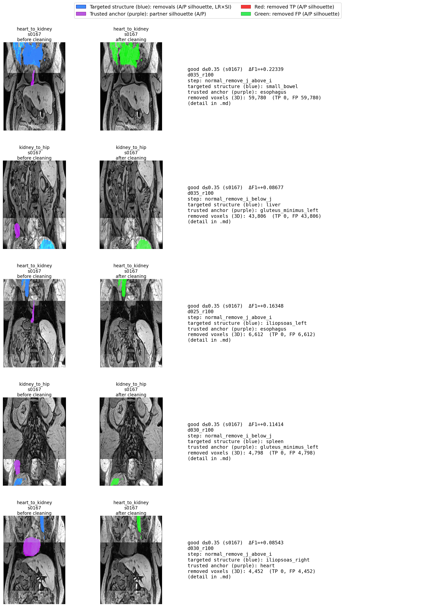
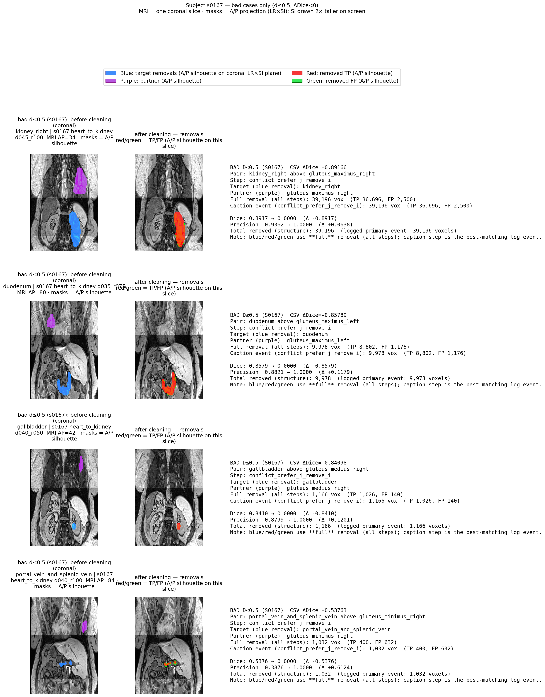

# Technical Reference Report: Anatomy Posets

This document covers every mechanism in the repository from end to end, in the order data flows through the system: GUI → relation matrix → multi-annotator aggregation → empirical poset → centre-of-mass atlases → artifact simulation → poset-based cleaning → evaluation.

---

## 1. Poset Construction GUI

### Overview

The GUI (`src/anatomy_poset/gui/`) is a PySide6 desktop application for eliciting anatomical spatial ordering from a human annotator. Launch it with:

```bash
anatomy-poset
# or
python run.py
```

The annotator either opens an existing session JSON or starts a new one. On start-up the application loads a list of anatomical structures (each with a name and three centre-of-mass coordinates), instantiates a `MatrixBuilder`, and begins presenting pairs.

### Workflow

Pairs are shown one at a time. The annotator answers whether structure A is **strictly above** structure B along the active axis (vertical by default). Three answers are available:

| Key | Meaning | Stored value |
|-----|---------|-------------|
| `F` | Yes — A is strictly above B | `+1` |
| `S` | No — A is not strictly above B | `−1` |
| `D` | Unsure | `0` |

Responses are auto-saved after every answer. The Hasse diagram (derived from all `+1` edges) updates live.

### Session JSON format

```json
{
  "structures": [
    { "name": "brain", "com_vertical": 115.3, "com_lateral": 50.0, "com_anteroposterior": 50.0 }
  ],
  "matrix_vertical": [[...], ...],
  "matrix_mediolateral": [[...], ...],
  "matrix_anteroposterior": [[...], ...]
}
```

CoM values for the vertical axis use the vertebrae-span normalisation: 0 = L5 inferior, 100 = C1 superior (structures above C1, such as the brain, exceed 100; structures below L5 are negative).

### Merging sessions

The **Merge JSON files...** dialog in the poset viewer combines multiple annotator sessions into a probability poset. Each cell in the output stores `P(yes)` — the fraction of annotators who answered `+1` for that directed pair. The merge logic is described in Section 4 (Multi-annotator aggregation).

---

## 2. Tri-valued Relation Matrix

### Cell semantics

The `n×n` matrix `M` stores one of four values per directed cell `M[i][j]` ("is structure i strictly above structure j?"):

| Value | Meaning |
|-------|---------|
| `+1` | i is strictly above j (annotator said Yes) |
| `−1` | i is not strictly above j (annotator said No, or implied by prior) |
| `0` | Queried but annotator was unsure |
| `None` | Not yet asked |

`None` serialises as JSON `null`. This vocabulary is richer than a simple yes/no matrix: the `None` entries distinguish "unanswered" from "answered No", which is important for aggregation and for knowing which pairs the annotator still needs to see.

### Initial state

When a `MatrixBuilder` is constructed, `initial_tri_valued_relation_matrix(n)` fills the matrix as follows:

- **Diagonal** (`M[i][i]`): `−1` — a structure cannot be strictly above itself.
- **Strict lower triangle** (`M[i][j]` where `i > j`): `−1` — structures are sorted by CoM descending, so by construction `CoM[i] < CoM[j]` for `i > j`, meaning i cannot be strictly above j under the CoM prior.
- **Strict upper triangle** (`M[i][j]` where `i < j`): `None` — these are the cells the annotator needs to fill.

After this initialisation, `_apply_com_not_above_prior()` also sets `−1` for any off-diagonal pair where the two structures have the same CoM value (neither can be strictly above the other).

---

## 3. Gap-Based Query Algorithm

### Pair ordering

The annotator is never asked to compare all n(n−1)/2 upper-triangle pairs; instead `MatrixBuilder` uses a **gap-based CoM strategy**. After sorting structures by descending CoM, the index gap between two structures is a proxy for how far apart they are anatomically. The query order is:

1. gap = 1: ask adjacent-CoM pairs (i, i+1) for i = 0 … n−2
2. gap = 2: ask (i, i+2) for i = 0 … n−3
3. … and so on up to gap = n−1

Within each gap level, the iterator sweeps i from 0 to n−1−gap. The rationale is that nearby structures have the most uncertain ordering (the annotator is most useful there), while transitivity propagation often resolves distant pairs automatically after nearby ones are answered.

### Skipping already-decided pairs

`next_pair()` skips any `(i, j)` where:

1. `M[i][j]` is not `None` — already answered (directly or by propagation).
2. `path_exists_matrix(i, j)` returns True — there is a `+1` chain from i to j through intermediate structures, so i being above j is already implied by transitivity (see Section 3.2).
3. Both `path_exists_matrix(i, j)` and `path_exists_matrix(j, i)` are True simultaneously — this would be a cycle in the `+1` graph; the cell is marked `0` (ambiguous) and skipped.
4. The pair is a bilateral Left/Right symmetric partner on the vertical axis (kidneys, femurs, etc.) — same-side anatomical cores cannot be strictly ordered on the vertical axis, so these cells are pre-set to `−1`.
5. `query_allowed_indices` is provided and either endpoint falls outside the allowed subset.

### Estimating remaining questions

`estimate_remaining_questions()` traverses the same gap loop from the current position and counts pairs that would not be skipped, giving the annotator a progress estimate.

---

## 4. Transitivity and Bilateral Symmetry

### Transitive closure (`_propagate`)

After every answer, `_propagate()` runs a fixed-point loop:

> If `M[i][j] == +1` and `M[j][k] == +1`, infer `M[i][k] = +1` (transitivity of strict ordering).

For each new `+1` entry:
- The inverse cell is set: `M[k][i] = −1` (strict ordering is asymmetric).
- Inference is blocked if `M[i][k]` is already `−1` (an explicit contradiction from the annotator is not overridden).
- Inference is blocked if `CoM[i] ≤ CoM[k]` (the CoM prior: we never infer that a lower-CoM structure is above a higher-CoM one purely by transitivity).
- Inference is blocked for Left/Right same-core pairs on the vertical axis.

After the `+1` fixed-point, `_close_transitive_unknowns()` sweeps remaining `None` cells: if a directed path exists from i to j (or j to i) in the `+1` graph, the corresponding cell is sealed with `+1` (or `−1`) so the annotator is not asked about an already-determined pair.

### Bilateral symmetry enforcement

For the vertical axis, Left and Right organs of the same anatomical core (e.g. `kidney_left` and `kidney_right`) must behave identically in all comparisons with third structures — there is no anatomical basis for "the left kidney is above the right lung but the right kidney is not". `_sync_vertical_bilateral_mirrors()` ensures:

- For every column k: `M[left][k] == M[right][k]` (if one is answered and the other is not, the answered value is copied; if they disagree, the smaller-index entry wins as a tie-break).
- For every row k: `M[k][left] == M[k][right]` (same).

The same-core pair itself is always `−1` in both directions (neither side is above the other on the vertical axis).

---

## 5. Multi-Annotator Aggregation

### CellAggregate

`aggregate_matrices_with_counts()` (`src/anatomy_poset/core/matrix_aggregation.py`) combines an arbitrary number of session files (tri-valued or probability) into a per-cell summary. Each cell accumulates:

- **mean** (µ) — weighted average of answers in [−1, +1]; tri-valued answers map as `+1 → +1`, `−1 → −1`, `0 → 0`. Probability files first convert `P` to µ via `µ = 2P − 1`.
- **n_answered** — total answer-weight contributed by answering files.
- **n_notasked** — number of files where the cell was `None`.
- **counts** — raw vote histogram {−1, 0, +1} for tri-valued sources.

### Weighted merging

When merging probability files that carry a `matrix_*_n_answered` sidecar (saved from a previous merge), each file contributes weight equal to its stored `n_answered` count for that cell (minimum 1 when missing). Raw tri-valued session files contribute weight 1 per cell. This lets a merged summary from 10 annotators count correctly against a single fresh annotator in a subsequent merge.

### Projecting to P(yes)

`aggregate_to_p_yes_matrix()` converts the per-cell mean µ ∈ [−1, +1] to a probability:

```
P(yes) = (µ + 1) / 2
```

`P(yes) = 1.0` means every annotator said Yes; `P(yes) = 0.0` means every annotator said No; `P(yes) = 0.5` means the annotators were split 50/50 or uniformly unsure. Cells where no file contributed an answer remain `null` in the output.

### Structure alignment (permutation)

Different annotation sessions may have structures listed in different orders (because different CoM JSON files were used as input). `align_matrix_lists_to_reference()` aligns all input files to a single reference structure ordering before aggregation. `find_alignment_permutation()` finds the bijective mapping from each file's structure list to the reference list by matching on (name, CoM) with a small floating-point tolerance, then `permute_relation_matrix()` reindexes rows and columns accordingly (`out[i][j] = M[perm[i]][perm[j]]`).

---

## 6. Dataset

All experiments use the **TotalsegmentatorMRI dataset v200** [Wasserthal et al., 2024], a publicly available collection of 616 whole-body MRI volumes with expert ground-truth segmentations of **50 anatomical structures** (organs, vessels, muscles, bones). Each subject directory contains `mri.nii.gz` (the raw volume) and `segmentations/` (one binary NIfTI mask per structure). The dataset ships with a canonical train/test split; the 10 held-out test subjects are:

```
s0022  s0167  s0175  s0186  s0187
s0219  s0236  s0237  s0243  s0250
```

These 10 subjects were selected as the test set because they have the **highest number of non-empty ground-truth structure masks** in the dataset — i.e. they are the most completely annotated subjects. Using the most fully-labelled subjects for evaluation maximises the number of structures that can be assessed per subject and minimises missing-structure artefacts in the metrics. They are **excluded from all offline computations** (CoM atlas, empirical poset) to prevent data leakage. All downstream analyses (CoM atlas, empirical poset) therefore use **606 training subjects × 50 structures = 30 300 ground-truth masks**. The same 10 held-out subjects serve as the evaluation cohort for the artifact-cleaning experiment (Section 10).

> **Reference:** Wasserthal, J., et al. "TotalSegmentator V2: A Comprehensive Multi-Task Medical Segmentation Model." *Radiology: Artificial Intelligence* 6(4), 2024. <https://doi.org/10.1148/ryai.230024>

---

## 7. Empirical Poset Extraction

### Purpose

Instead of asking human annotators, we can derive a spatial ordering automatically from ground-truth segmentations across a large cohort. The empirical poset captures how consistently one structure is located strictly superior to another across real subjects.

### Script: `compute_empirical_poset.py`

For every ordered pair `(i, j)` and every anatomical axis:

```
P(i strictly above j) = count(subjects where bbox(i) is entirely above bbox(j))
                        / count(subjects where both i and j are present)
```

"Strictly above" on the vertical axis means the anatomical **inferior boundary** of structure i (the lowest non-zero voxel projected to the S-I axis) lies above the anatomical **superior boundary** of structure j (the highest non-zero voxel). No overlap is allowed — if even a single voxel of i's extent overlaps j's extent on the S-I axis, the pair does not count as strictly above for that subject.

The script:
1. Discovers all subject directories and optionally excludes a held-out test set (`--exclude`).
2. For each subject, loads every `segmentations/*.nii.gz`, converts bounding box extents to anatomical fractions via the affine's axis codes (handling both S-axis and I-axis orientations).
3. Accumulates `strictly_above[ax][i,j]` and `both_present[i,j]` counts.
4. Computes the ratio; cells with fewer than `--min_subjects` (default 5) co-occurrences are left as `null`.
5. Writes a JSON in the same format as a merged annotator session, loadable directly by the GUI and cleaning scripts.

### Primary poset: `totalseg_mri_empirical_poset.json`

- **50 structures** from TotalSegmentator MRI v200
- **606 subjects** (616 total minus 10 held-out test subjects)
- Test subjects excluded: `s0175 s0236 s0219 s0187 s0022 s0167 s0186 s0237 s0243 s0250`
- **303 pairs** have P ≥ 0.99 on the vertical axis
- Structure ordering fixed by the MRI CoM atlas (`--com_json`)

---

## 7. Centre-of-Mass Atlases

Two CoM atlases are provided. Neither is required by poset-based cleaning at inference time; they serve as structure-ordering priors for the GUI and as references for any future atlas-based approach.

### MRI atlas: `totalseg_mri_com_landmark.json`

**Normalization:** vertebrae-landmark normalisation. For each subject, the combined vertebrae mask (`vertebrae.nii.gz`) provides two landmarks:

- `vert_sup` — S-I voxel index of the vertebrae's superior edge (≈ C1 top)
- `vert_inf` — S-I voxel index of the vertebrae's inferior edge (≈ L5 bottom)

Each structure's centroid along S-I is then:

```
com_vertical = 100 × (centroid_si − vert_inf) / (vert_sup − vert_inf)
```

This is scan-extent independent: two subjects with different fields of view but identical anatomy produce the same `com_vertical` for every organ, because the centroid and the landmark are expressed in the same subject-local frame. Structures below L5 (femur, hip, gluteus) have `com_vertical < 0`; structures above C1 (brain) have `com_vertical > 100`.

Lateral (`com_lateral`) and AP (`com_anteroposterior`) coordinates use image-extent normalisation (fraction 0–100 of the scan axis), which is less consistent across subjects but sufficient for the GUI's bilateral-symmetry pairing.

**Coverage:**
- 50 structures (the full TotalSegmentator MRI label set)
- 606 subjects (10 test subjects excluded to prevent data leakage)
- Structures seen in fewer than 5 subjects are dropped

### CT atlas: `totalseg_v2_com.json`

**Normalization:** image-extent normalisation (each centroid expressed as a fraction of the scan's axis length). This is less anatomically consistent than the landmark-normalised version because scans with different fields of view produce different fractions for the same organ.

**Coverage:**
- 117 structures (the full TotalSegmentator v2.01 CT label set)
- Includes individual vertebrae levels (C1–L5) not available in the MRI label set
- Computed from the TotalSegmentator v2.01 CT benchmark dataset

The CT atlas is kept as a legacy reference for CT-specific work or when the larger structure set is needed.

---

## 8. Wrap-Around Artifact Simulation (WM3)

### Physical model

MRI wrap-around (aliasing) occurs when anatomy extends beyond the scanner's field of view (FOV). Signal from outside the FOV folds back into the image. In the superior–inferior direction, anatomy just above the superior FOV boundary wraps to appear at the inferior end of the image, and anatomy just below the inferior FOV boundary wraps to appear at the superior end.

WM3 simulates this by taking a cropped anatomical window (the simulated FOV) and adding ghost layers from just outside each boundary:

```
extended window = N + 2d slices   (d above FOV + N FOV + d below FOV)

  d slices above FOV  →  wrap to INFERIOR end of FOV image
  ──────────────────────────────────────────────────────
       N slices = FOV image  (what TotalSegmentator sees)
  ──────────────────────────────────────────────────────
  d slices below FOV  →  wrap to SUPERIOR end of FOV image
```

### Parameters

| Parameter | Symbol | Range used | Meaning |
|-----------|--------|------------|---------|
| Shift fraction | `d` | 0.05–0.50 | Fraction of FOV height that wraps in from each edge |
| Ghost intensity | `r` | 0.25–1.00 | Scaling factor applied to the ghost signal |

`d = 0.10` means the 10% of the full volume just outside each FOV boundary wraps in. `r = 1.0` means the ghost has the same intensity as the original signal.

### Implementation

For each anatomical crop window and each (d, r) combination:

1. Load the full MRI volume and GT segmentations to determine the crop extent.
2. Extend the window by d above and below to build `I_hat` (ghost layer):
   ```python
   I_hat = np.zeros_like(I, dtype=np.float32)
   # For S-axis (si_sign=+1, high index = superior):
   I_hat[si_slice(0, d)] = I[si_slice(M - d, M)] * r   # top wraps to bottom
   I_hat[si_slice(N - d, N)] = I[si_slice(M, M + d)] * r   # bottom wraps to top
   ```
3. Add ghost directly: `I_s = I + I_hat`. No body masking, no brightness normalisation — real MRI aliasing adds the wrapped signal everywhere (air, background, tissue). `r` alone controls ghost intensity.
4. Crop the result to `[crop_lo, crop_hi]` along the S-I axis; update the affine origin if the crop removes slices from the inferior end.

### Why no body masking and no brightness normalisation

The paper applies a foreground mask `F = (I > 0)` and a brightness normalisation factor `I2/I1`. Both are omitted in WM3 for physical correctness:

- **No body masking:** Real MRI aliasing is a Fourier phenomenon — the aliased signal adds everywhere in the image, including in background air. Masking the ghost to `I > 0` produces a jagged artifact at the body boundary (because MRI background is not exactly zero — thermal noise gives small non-zero values) rather than the clean ghost a scanner would produce.
- **No brightness normalisation:** The `I2/I1` factor is designed for large horizontal wraps where the wrapped area is a substantial fraction of the image. For vertical S-I wrap with small `d`, the wrapped strip is a thin sliver, so `I2/I1 ≪ 1` and the ghost would appear nearly black — not physically realistic. `r` alone controls ghost intensity and directly matches the real parameter (ghost signal = r × wrapped anatomy signal).

### Crop windows

Three anatomical windows are defined by the S-I extent of GT anchor structures (±5 voxel margin):

| Crop | Superior anchor | Inferior anchor | Available subjects |
|------|----------------|-----------------|-------------------|
| `brain_to_heart` | brain | heart | s0175, s0236 only |
| `heart_to_kidney` | heart | kidney_left | all 10 |
| `kidney_to_hip` | kidney_left | hip_left | all 10 |

### Experiment scale

880 conditions: 10 subjects × (2 or 3 crops) × 10 d values × 4 r values. Each `mri_artifact.nii.gz` is segmented with **TotalSegmentator v2.13.0** using `--task total_mr --fast` (MRI model, 3 mm isotropic resolution) to produce per-structure binary masks. `--task total_mr` selects the MRI-specific model weights; without this flag TotalSegmentator defaults to the CT model, which is not valid for MRI inputs.

---

## 9. Poset-Based Cleaning

### Overview

Poset-based cleaning (**middle-out + constraint-consistency**, abbreviated PC) is a purely subtractive post-processing step that removes anatomically impossible connected components from TotalSegmentator predictions. It requires only:

- The predicted binary masks (one per structure)
- The empirical poset (a JSON with P(i above j) for each pair)
- The image affine (to determine the S-I axis orientation)

No atlas is consulted at inference time. The pair ordering in the poset, derived offline from the CoM atlas, is sufficient to identify ghosts.

### Connected component analysis

For each predicted mask, `get_components()` uses `scipy.ndimage.label` to find all connected components. The **largest connected component (LCC)** by voxel count is taken as the primary candidate for the real structure. `axis_extent(mask, si_ax)` returns `(min_voxel_index, max_voxel_index)` along the S-I axis for any binary mask.

### Active constraint pairs

`_get_pairs(poset, threshold)` extracts all pairs `(name_i, name_j)` from the poset where `P(i above j) ≥ threshold`. Three thresholds are evaluated:

| Threshold | Behaviour |
|-----------|-----------|
| 0.95 | Fires when ≥95% of training subjects show this ordering |
| 0.99 | Fires when ≥99% show this ordering |
| 1.00 | Fires only for pairs never violated in any training subject |

### Middle-out ordering

Pairs are processed in order of how central the predicted LCCs are to the image. For each pair `(i, j)`, compute the midpoint between i's LCC centre and j's LCC centre along S-I, then sort ascending by distance of that midpoint from the image centre `N/2`. Pairs involving aorta, spine, and other central structures are processed first; pairs involving brain, femur, and other peripheral structures are processed later. This means the peripheral cleanings are informed by already-trustworthy central anchors.

**Why middle-out, and when to deviate.** Wrap-around aliasing can originate from either end of the FOV: anatomy above the superior boundary folds into the inferior portion of the image, and anatomy below the inferior boundary folds into the superior portion. Because the ghost source is unknown a priori, the safest assumption is that neither edge is clean, making the image centre the most trustworthy starting point. Middle-out ordering encodes this assumption directly.

If the acquisition geometry is known, however, a more targeted ordering can improve results. For example, if the FOV covers the full head but is truncated at the neck — so wrap-around can only enter from the inferior edge — the superior structures are guaranteed artifact-free. In that case, sorting pairs from superior to inferior (clean-end first) establishes anchors from the definitively ghost-free region and propagates cleaning downward toward the contaminated edge, reducing the risk of cascade errors near the clean boundary. Conversely, if only the inferior boundary is clean (e.g. a pelvis-to-head scan truncated at the top), pairs should be sorted inferior-to-superior. Middle-out is the correct default when FOV truncation side is unknown.

### Constraint-consistency guard

For pair `(i above j)` — meaning the empirical poset says i is consistently superior to j — the guard checks whether i's LCC is **entirely below** j's LCC:

```python
def _is_entirely_below(ext_a, ext_b) -> bool:
    if si_sign == +1:
        return ext_a[1] < ext_b[0]   # a's superior edge < b's inferior edge
    else:
        return ext_a[0] > ext_b[1]
```

If this condition holds, i is displaced from its expected position. Because the pair ordering encodes the CoM prior (i should be superior to j), there is only one explanation: i's LCC is a wrap-around ghost that appeared at the wrong end of the image. The guard triggers:

```python
if _is_entirely_below(ext_i, ext_j):
    _remove_violated_components(..., below_limit=ext_j[0], protect_anchor=False)
    anchor_i, ext_i = None, None   # skip normal cleaning for this pair
    anchor_j, ext_j = None, None
```

`protect_anchor=False` is critical: it sets `anchor_label = -1`, meaning **no component is protected** from removal, including the LCC itself. All i-components below j's inferior boundary are removed. Any real fragment of i that already sits above j is left intact; on the next access to the CC cache, it will be found as the new LCC and used as the anchor for subsequent pairs.

### Normal symmetric cleaning

After the guard (or if it did not trigger), normal cleaning proceeds:

- Remove any non-anchor component of i that lies entirely below j's inferior boundary (i.e. a stray fragment of i that is too far inferior to be real given j's position).
- Remove any non-anchor component of j that lies entirely above i's superior boundary (i.e. a stray fragment of j that is too far superior given i's position).

The anchor for i is its current LCC; the anchor is never removed in this step.

### Cache invalidation

`_remove_violated_components()` updates `cleaned[name]` in place and calls `cc_cache.pop(name, None)` whenever any voxels are removed. The next access to this structure's CC cache re-runs `get_components()` on the updated mask, ensuring that downstream pairs see the new (post-removal) LCC, not the stale one.

### `_remove_violated_components` in full

```python
def _remove_violated_components(
    cleaned, removed, name, si_ax, si_sign,
    below_limit, above_limit,
    cc_cache,
    anchor_override=None,
    protect_anchor=True,
) -> bool:
    mask = cleaned[name]
    labeled, n, sizes, lcc_label = get_or_compute_cc(mask, cc_cache, name)

    if not protect_anchor:
        anchor_label = -1           # protect nothing
    elif anchor_override is not None:
        # anchor = component with most overlap with anchor_override mask
        anchor_label = component_with_max_overlap(labeled, anchor_override)
    else:
        anchor_label = lcc_label    # default: protect the LCC

    for comp_label in range(1, n + 1):
        if comp_label == anchor_label:
            continue
        ext = axis_extent(labeled == comp_label, si_ax)
        violated = (below_limit is not None and entirely_below(ext, below_limit, si_sign))
                or (above_limit is not None and entirely_above(ext, above_limit, si_sign))
        if violated:
            cleaned[name][labeled == comp_label] = False
            removed[name] += component_size

    if any voxels were removed:
        cc_cache.pop(name, None)
    return changed
```

### Computational complexity

**Inputs:** S structures, n active constraint pairs (n ≈ 300–500 at threshold 0.95), V voxels per per-structure binary mask.

| Step | Complexity | Notes |
| --- | --- | --- |
| Connected-component labeling (all S structures) | O(S · V) | `scipy.ndimage.label`; done once per structure, result cached |
| Sort pairs by LCC midpoint | O(n log n) | Negligible relative to labeling |
| Per-pair cleaning loop | O(n · V/S) | axis_extent + component removal; cache hit on unmodified structures |
| Cache invalidation + re-label on modified structures | O(k · V/S) | k = number of structures actually modified; typically small |

**Overall: O(S · V + n · V/S)**, dominated by the initial connected-component labeling pass. In practice on a cropped MRI (~50 structures, ~150 × 200 × 200 per-structure mask): **well under one second** per condition. The algorithm is CPU-only and memory-bandwidth-bound, not compute-bound. It adds negligible latency to a TotalSegmentator inference pipeline.

---

## 10. Morphological Opening Baseline

To benchmark the poset-based cleaner, we compare it against an established anatomy-agnostic post-processing method: **morphological opening** — binary erosion followed by binary dilation with the same structuring element — combined with **largest-connected-component (LCC)** retention.

### Rationale

Morphological operations are a standard post-processing tool in medical image segmentation. A survey of deep-learning-based multi-organ segmentation (Fu et al., 2021) identifies morphological operations as "widely used to remove small erroneous labels." nnU-Net — the dominant segmentation framework in medical imaging, winning over 23 MICCAI challenges — includes automated LCC selection as a default post-processing step: it empirically tests whether keeping only the LCC per class improves validation Dice, and applies it if so (Isensee et al., 2021). Furtado (2021) describes the specific pipeline used here for abdominal MRI segmentation: *"preceding the calculation of the largest region by morphological erosion, then calculating and isolating the largest region, subsequently applying dilation with the same structuring element and size to reverse the previous erosion operation. The erosion frequently eliminates noise in the borders and some spurious connections to neighbouring regions."* Recent MICCAI work frames morphological erosion/opening as "valuable tools for processing and analysing segmentation masks" and proposes differentiable variants for end-to-end learning (Guzzi et al., 2024), while published U-Net pipelines use explicit erosion–dilation cycles with LCC filtering as a core post-processing stage (Neeteson et al., 2023).

### Algorithm

For each predicted binary structure mask:

1. **Erode** with a ball-shaped 3-D structuring element of radius *r* voxels (`scipy.ndimage.binary_erosion`):
   - Small disconnected components — wrap-around ghost fragments narrower than *r* voxels — disappear entirely.
   - Thin connections between a real structure and a ghost blob are severed, making them separately identifiable.

2. **Keep LCC** of the eroded result (`scipy.ndimage.label`, retain the largest label):
   - If multiple components survive erosion, only the largest is kept; all smaller fragments are discarded.
   - If erosion empties the mask completely (structure smaller than the structuring element), the original mask is returned unchanged to avoid spurious zero-Dice outcomes.

3. **Dilate** with the same ball and clamp to the original mask:
   - Dilation approximately restores the true structure to its pre-erosion extent.
   - Clamping with `dilated & original` ensures the operation is **purely subtractive** — no new voxels are ever added, only ghost voxels removed.

The default structuring element radius is 2 voxels (a 5 × 5 × 5 ball at 3 mm isotropic resolution, corresponding to a 6 mm physical radius). A smaller radius (r = 1) is less aggressive and may retain thin ghost connections; a larger radius (r = 3–4) risks eroding real thin structures such as the esophagus or portal vein.

We also evaluate a simpler sub-baseline, **LCC-only** (no erosion or dilation), which keeps only the largest connected component of the raw prediction mask without any morphological processing. This corresponds directly to the nnU-Net post-processing heuristic (Isensee et al., 2021) and provides a lower bound: any improvement from `opening_lcc` over `lcc_only` is attributable purely to the morphological filtering step.

### Key limitation

The morphological opening baseline is **anatomy-agnostic**: it uses no knowledge of the spatial ordering constraints encoded in the poset. It can only remove components that are smaller than the structuring element or smaller than the LCC. In the wrap-around artifact setting, a ghost blob can be large — particularly at high ghost intensity (r ≥ 0.75) or large shift (d ≥ 0.25) — and may be equal in size to, or larger than, the true anatomy component. In those conditions LCC selection retains the ghost and discards the real structure, causing the baseline to fail systematically in exactly the regime where the artifact is most severe. The poset-based cleaner, by contrast, identifies ghosts by their anatomical position relative to partner structures — a criterion that is invariant to ghost size and therefore effective precisely where LCC selection is not.

### Implementation

The baseline is implemented in `scripts/cleaning/evaluate_erosion_baseline.py`. It uses the same evaluation loop, crop windows, GT masks, and metrics (Dice, Precision, Recall, voxels removed) as `evaluate_cleaning_methods.py`, producing a compatible `results.csv` for direct comparison.

```bash
python scripts/cleaning/evaluate_erosion_baseline.py \
    --exp_dir   data/wraparound_experiments/wraparound_v4 \
    --subjects  s0175 s0236 s0219 \
    --out_dir   data/wraparound_experiments/wraparound_v4_eval/erosion_baseline \
    --method    opening_lcc \
    --radius    2
```

### Results (10 subjects: s0022, s0167, s0175, s0186, s0187, s0219, s0236, s0237, s0243, s0250)

Evaluated over all 40 artifact conditions (10 d × 4 r). No-artifact reference (d=0, r=0): **Dice = 0.821, Precision = 0.839** (same for all methods — artifact simulation is independent of the cleaning step). "Dice (artifact)" is the mean Dice of the raw prediction with artifact present, before any cleaning. "Δ Dice (cleaning)" and "Δ Prec (cleaning)" show the change due to the cleaning method only (after − before cleaning).

#### Overall

| Method | Dice (artifact) | Dice (cleaned) | Δ Dice (mean ± SD) | Prec (artifact) | Prec (cleaned) | Δ Prec (mean ± SD) |
| ------ | --------------- | -------------- | ------------------- | --------------- | -------------- | ------------------- |
| LCC only | 0.751 | 0.704 | −0.047 ± 0.138 | 0.806 | 0.810 | +0.003 ± 0.065 |
| Opening r=1 | 0.751 | 0.673 | −0.078 ± 0.158 | 0.806 | 0.849 | +0.043 ± 0.078 |
| Opening r=2 | 0.751 | 0.649 | −0.102 ± 0.183 | 0.806 | 0.853 | +0.046 ± 0.086 |
| Poset cleaning (t=1.00) | 0.758 | 0.716 | −0.042 ± 0.180 | 0.810 | 0.820 | +0.011 ± 0.082 |

#### By ghost intensity r

| Method | r | Dice (artifact) | Dice (cleaned) | Δ Dice (mean ± SD) | Prec (artifact) | Prec (cleaned) | Δ Prec (mean ± SD) |
| ------ | - | --------------- | -------------- | ------------------- | --------------- | -------------- | ------------------- |
| LCC only | 0.25 | 0.790 | 0.744 | −0.046 ± 0.137 | 0.825 | 0.828 | +0.003 ± 0.039 |
| LCC only | 0.50 | 0.765 | 0.718 | −0.047 ± 0.138 | 0.814 | 0.817 | +0.003 ± 0.061 |
| LCC only | 0.75 | 0.736 | 0.688 | −0.048 ± 0.137 | 0.800 | 0.803 | +0.003 ± 0.073 |
| LCC only | 1.00 | 0.711 | 0.663 | −0.048 ± 0.139 | 0.785 | 0.789 | +0.004 ± 0.079 |
| Opening r=1 | 0.25 | 0.790 | 0.713 | −0.077 ± 0.159 | 0.825 | 0.870 | +0.045 ± 0.056 |
| Opening r=1 | 0.50 | 0.765 | 0.686 | −0.079 ± 0.159 | 0.814 | 0.856 | +0.042 ± 0.076 |
| Opening r=1 | 0.75 | 0.736 | 0.657 | −0.079 ± 0.158 | 0.800 | 0.840 | +0.041 ± 0.085 |
| Opening r=1 | 1.00 | 0.711 | 0.636 | −0.075 ± 0.156 | 0.785 | 0.827 | +0.043 ± 0.090 |
| Opening r=2 | 0.25 | 0.790 | 0.687 | −0.103 ± 0.186 | 0.825 | 0.875 | +0.050 ± 0.066 |
| Opening r=2 | 0.50 | 0.765 | 0.662 | −0.103 ± 0.184 | 0.814 | 0.861 | +0.048 ± 0.086 |
| Opening r=2 | 0.75 | 0.736 | 0.634 | −0.102 ± 0.182 | 0.800 | 0.844 | +0.044 ± 0.093 |
| Opening r=2 | 1.00 | 0.711 | 0.611 | −0.101 ± 0.180 | 0.785 | 0.829 | +0.044 ± 0.095 |
| Poset (t=1.00) | 0.25 | 0.801 | 0.793 | −0.007 ± 0.075 | 0.831 | 0.833 | +0.002 ± 0.035 |
| Poset (t=1.00) | 0.50 | 0.774 | 0.738 | −0.036 ± 0.167 | 0.819 | 0.826 | +0.007 ± 0.060 |
| Poset (t=1.00) | 0.75 | 0.742 | 0.683 | −0.059 ± 0.208 | 0.803 | 0.817 | +0.015 ± 0.096 |
| Poset (t=1.00) | 1.00 | 0.715 | 0.647 | −0.068 ± 0.226 | 0.787 | 0.805 | +0.019 ± 0.115 |

#### By shift fraction d

| Method | d | Dice (artifact) | Dice (cleaned) | Δ Dice (mean ± SD) | Prec (artifact) | Prec (cleaned) | Δ Prec (mean ± SD) |
| ------ | - | --------------- | -------------- | ------------------- | --------------- | -------------- | ------------------- |
| LCC only | 0.05 | 0.796 | 0.750 | −0.046 ± 0.137 | 0.828 | 0.831 | +0.003 ± 0.034 |
| LCC only | 0.10 | 0.788 | 0.742 | −0.046 ± 0.137 | 0.828 | 0.831 | +0.004 ± 0.038 |
| LCC only | 0.15 | 0.775 | 0.730 | −0.046 ± 0.136 | 0.822 | 0.826 | +0.004 ± 0.044 |
| LCC only | 0.20 | 0.763 | 0.716 | −0.047 ± 0.138 | 0.813 | 0.817 | +0.004 ± 0.059 |
| LCC only | 0.25 | 0.751 | 0.703 | −0.048 ± 0.140 | 0.805 | 0.807 | +0.002 ± 0.070 |
| LCC only | 0.30 | 0.742 | 0.696 | −0.046 ± 0.138 | 0.801 | 0.806 | +0.005 ± 0.071 |
| LCC only | 0.35 | 0.733 | 0.685 | −0.047 ± 0.138 | 0.795 | 0.800 | +0.004 ± 0.076 |
| LCC only | 0.40 | 0.726 | 0.678 | −0.048 ± 0.137 | 0.792 | 0.796 | +0.004 ± 0.075 |
| LCC only | 0.45 | 0.717 | 0.669 | −0.048 ± 0.137 | 0.788 | 0.792 | +0.004 ± 0.079 |
| LCC only | 0.50 | 0.715 | 0.665 | −0.050 ± 0.138 | 0.786 | 0.788 | +0.002 ± 0.080 |
| Opening r=1 | 0.05 | 0.796 | 0.720 | −0.077 ± 0.159 | 0.828 | 0.874 | +0.045 ± 0.054 |
| Opening r=1 | 0.10 | 0.788 | 0.711 | −0.077 ± 0.159 | 0.828 | 0.872 | +0.044 ± 0.057 |
| Opening r=1 | 0.15 | 0.775 | 0.698 | −0.077 ± 0.159 | 0.822 | 0.866 | +0.044 ± 0.062 |
| Opening r=1 | 0.20 | 0.763 | 0.684 | −0.079 ± 0.161 | 0.813 | 0.855 | +0.042 ± 0.075 |
| Opening r=1 | 0.25 | 0.751 | 0.672 | −0.079 ± 0.158 | 0.805 | 0.848 | +0.043 ± 0.078 |
| Opening r=1 | 0.30 | 0.742 | 0.664 | −0.078 ± 0.158 | 0.801 | 0.844 | +0.043 ± 0.082 |
| Opening r=1 | 0.35 | 0.733 | 0.655 | −0.078 ± 0.159 | 0.795 | 0.837 | +0.042 ± 0.090 |
| Opening r=1 | 0.40 | 0.726 | 0.648 | −0.078 ± 0.156 | 0.792 | 0.833 | +0.041 ± 0.089 |
| Opening r=1 | 0.45 | 0.717 | 0.640 | −0.077 ± 0.156 | 0.788 | 0.829 | +0.041 ± 0.089 |
| Opening r=1 | 0.50 | 0.715 | 0.638 | −0.078 ± 0.156 | 0.786 | 0.827 | +0.040 ± 0.091 |
| Opening r=2 | 0.05 | 0.796 | 0.696 | −0.101 ± 0.184 | 0.828 | 0.879 | +0.051 ± 0.063 |
| Opening r=2 | 0.10 | 0.788 | 0.685 | −0.104 ± 0.187 | 0.828 | 0.877 | +0.049 ± 0.068 |
| Opening r=2 | 0.15 | 0.775 | 0.674 | −0.101 ± 0.182 | 0.822 | 0.871 | +0.049 ± 0.072 |
| Opening r=2 | 0.20 | 0.763 | 0.660 | −0.103 ± 0.184 | 0.813 | 0.860 | +0.046 ± 0.084 |
| Opening r=2 | 0.25 | 0.751 | 0.647 | −0.104 ± 0.185 | 0.805 | 0.851 | +0.045 ± 0.090 |
| Opening r=2 | 0.30 | 0.742 | 0.640 | −0.102 ± 0.184 | 0.801 | 0.848 | +0.047 ± 0.087 |
| Opening r=2 | 0.35 | 0.733 | 0.631 | −0.102 ± 0.182 | 0.795 | 0.840 | +0.044 ± 0.095 |
| Opening r=2 | 0.40 | 0.726 | 0.625 | −0.101 ± 0.180 | 0.792 | 0.837 | +0.045 ± 0.094 |
| Opening r=2 | 0.45 | 0.717 | 0.617 | −0.100 ± 0.180 | 0.788 | 0.833 | +0.045 ± 0.097 |
| Opening r=2 | 0.50 | 0.715 | 0.612 | −0.103 ± 0.181 | 0.786 | 0.829 | +0.043 ± 0.101 |
| Poset (t=1.00) | 0.05 | 0.807 | 0.807 | 0.000 ± 0.000 | 0.835 | 0.835 | 0.000 ± 0.000 |
| Poset (t=1.00) | 0.10 | 0.800 | 0.800 | 0.000 ± 0.000 | 0.834 | 0.834 | 0.000 ± 0.001 |
| Poset (t=1.00) | 0.15 | 0.788 | 0.782 | −0.005 ± 0.070 | 0.829 | 0.831 | +0.003 ± 0.046 |
| Poset (t=1.00) | 0.20 | 0.776 | 0.751 | −0.024 ± 0.141 | 0.821 | 0.830 | +0.009 ± 0.062 |
| Poset (t=1.00) | 0.25 | 0.759 | 0.721 | −0.038 ± 0.177 | 0.810 | 0.821 | +0.012 ± 0.066 |
| Poset (t=1.00) | 0.30 | 0.746 | 0.686 | −0.060 ± 0.214 | 0.803 | 0.819 | +0.016 ± 0.087 |
| Poset (t=1.00) | 0.35 | 0.736 | 0.672 | −0.064 ± 0.218 | 0.798 | 0.814 | +0.017 ± 0.092 |
| Poset (t=1.00) | 0.40 | 0.730 | 0.655 | −0.074 ± 0.231 | 0.794 | 0.810 | +0.017 ± 0.103 |
| Poset (t=1.00) | 0.45 | 0.721 | 0.641 | −0.080 ± 0.237 | 0.790 | 0.807 | +0.018 ± 0.122 |
| Poset (t=1.00) | 0.50 | 0.716 | 0.637 | −0.079 ± 0.236 | 0.788 | 0.801 | +0.015 ± 0.126 |

Plots:

- `data/wraparound_experiments/wraparound_v4_eval/erosion_baseline/dice_by_d_erosion_baseline.png`
- `data/wraparound_experiments/wraparound_v4_eval/erosion_baseline/prec_by_d_erosion_baseline.png`

**Key finding:** LCC-only barely changes Precision (+0.003) while consistently degrading Dice (−0.047) — it is the most conservative but also least effective baseline. Opening with r=1 recovers ghost FP more aggressively (Precision +0.043) but at a higher Dice cost (−0.078). Opening with r=2 further maximises Precision gain (+0.046) at severe Dice cost (−0.102). Poset-based cleaning achieves the best Dice/Precision trade-off: smaller Dice loss (−0.042 vs −0.078 for r=1) with comparable Precision recovery (+0.010), because it uses anatomical position to discriminate ghost from real anatomy rather than relying purely on component size.

### Baseline literature

- Furtado, P.N. (2021). Improving Deep Segmentation of Abdominal Organs MRI by Post-Processing. *BioMedInformatics* 1(3), 88–105. [doi:10.3390/biomedinformatics1030007](https://doi.org/10.3390/biomedinformatics1030007)
- Isensee, F. et al. (2021). nnU-Net: A Self-Configuring Method for Deep Learning-Based Biomedical Image Segmentation. *Nature Methods* 18, 203–211. [doi:10.1038/s41592-020-01008-z](https://doi.org/10.1038/s41592-020-01008-z)
- Fu, Y. et al. (2021). A Review of Deep Learning Based Methods for Medical Image Multi-Organ Segmentation. *Physica Medica* 85, 107–122. [doi:10.1016/j.ejmp.2021.05.003](https://doi.org/10.1016/j.ejmp.2021.05.003)
- Neeteson, N.J. et al. (2023). Automatic Segmentation of Trabecular and Cortical Compartments in HR-pQCT Images Using an Embedding-Predicting U-Net and Morphological Post-processing. *Scientific Reports* 13, 252. [doi:10.1038/s41598-022-27350-0](https://doi.org/10.1038/s41598-022-27350-0)
- Guzzi, L. et al. (2024). Differentiable Soft Morphological Filters for Medical Image Segmentation. *MICCAI 2024*, LNCS 15009, 174–183. [doi:10.1007/978-3-031-72111-3_17](https://doi.org/10.1007/978-3-031-72111-3_17)

---

## 11. Evaluation

### Why precision, and why we keep Dice

Poset-based cleaning is **purely subtractive** — it can only remove voxels, never add them. Therefore:

- **Recall** = TP / (TP + FN) is mathematically invariant to cleaning (FN never changes).
- **Precision** = TP / (TP + FP) is the primary metric: it directly measures FP reduction, which is the only thing poset-based cleaning does.
- **Dice** is reported for comparability with published TotalSegmentator benchmarks. Because poset-based cleaning can remove a small number of TPs when it aggressively cleans, Dice can degrade slightly even when precision improves.

### Evaluation loop

For each (subject, crop, d, r):
1. Load all predicted masks from `segmentations/`.
2. Determine crop window from GT anchor structures.
3. Apply poset-based cleaning in memory (no disk write).
4. Compute Dice and Precision before/after for every structure with a GT mask in the crop.
5. Write a row to `results.csv`.

After all conditions, `make_plots()` generates heatmaps, bar charts, stacked count plots, a per-structure diverging bar, and a ΔDice vs ΔPrecision scatter. `make_report()` writes `report.md` with statistical tables.

### Full results (wraparound_v4)

Dataset: 10 subjects × 3 crops × 40 artifact conditions (10 d × 4 r) = **25 866** structure×condition pairs evaluated.
Artifacts re-simulated with corrected physics (no body-foreground masking; `I_s = I + I_hat`).
Segmentations produced with `TotalSegmentator --task total_mr --fast` (MRI model, 3 mm).

#### Overall — effect of threshold

Wilcoxon signed-rank test (two-sided, H₀: median Δ = 0).

No-artifact reference (d=0, r=0): Dice = 0.821, Precision = 0.839.

| Threshold | Dice (artifact) | Dice (cleaned) | Δ Dice (mean ± SD) | p | Prec (artifact) | Prec (cleaned) | Δ Prec (mean ± SD) | p |
| --------- | --------------- | -------------- | ------------------- | - | --------------- | -------------- | ------------------- | - |
| 1.00 | 0.757 | 0.715 | −0.042 ± 0.180 | <1e-100 | 0.808 | 0.819 | +0.011 ± 0.082 | <1e-100 |
| 0.99 | 0.756 | 0.714 | −0.042 ± 0.180 | <1e-100 | 0.808 | 0.819 | +0.011 ± 0.082 | <1e-100 |
| 0.95 | 0.756 | 0.700 | −0.056 ± 0.206 | <1e-100 | 0.809 | 0.821 | +0.012 ± 0.094 | <1e-100 |

Higher thresholds (fewer constraints active) produce fewer but more reliable corrections; the net Dice improves across all thresholds but Precision improves consistently at every threshold.

#### By crop region (threshold = 1.00)

| Crop | Dice (artifact) | Dice (cleaned) | Δ Dice (mean ± SD) | p | Prec (artifact) | Prec (cleaned) | Δ Prec (mean ± SD) | p |
| ---- | --------------- | -------------- | ------------------- | - | --------------- | -------------- | ------------------- | - |
| brain to heart | 0.704 | 0.561 | −0.143 ± 0.313 | 2.4e-50 | 0.741 | 0.752 | +0.011 ± 0.149 | 4.3e-13 |
| heart to kidney | 0.738 | 0.652 | −0.086 ± 0.245 | <1e-100 | 0.790 | 0.810 | +0.020 ± 0.102 | <1e-100 |
| kidney to hip | 0.776 | 0.777 | +0.001 ± 0.019 | 4.1e-32 | 0.830 | 0.833 | +0.003 ± 0.048 | 1.4e-33 |

The `kidney to hip` crop is the only region where Dice also improves on average — there are no degradations at all. The `brain to heart` crop suffers the most (structures like scapula, humerus, and heart are close to the wrap ghost).

#### By ghost intensity r (threshold = 1.00)

| r | Dice (artifact) | Dice (cleaned) | Δ Dice (mean ± SD) | p | Prec (artifact) | Prec (cleaned) | Δ Prec (mean ± SD) | p |
| - | --------------- | -------------- | ------------------- | - | --------------- | -------------- | ------------------- | - |
| 0.25 | 0.800 | 0.793 | −0.007 ± 0.075 | 7.8e-13 | 0.830 | 0.832 | +0.002 ± 0.035 | 1.9e-09 |
| 0.50 | 0.773 | 0.737 | −0.036 ± 0.167 | 3.0e-58 | 0.818 | 0.825 | +0.007 ± 0.060 | 1.7e-45 |
| 0.75 | 0.739 | 0.680 | −0.059 ± 0.208 | 1.6e-97 | 0.800 | 0.815 | +0.015 ± 0.096 | 7.5e-77 |
| 1.00 | 0.713 | 0.645 | −0.068 ± 0.226 | 3.5e-105 | 0.784 | 0.803 | +0.019 ± 0.115 | 7.2e-98 |

Precision improves at all intensities. Dice degrades more as the ghost grows stronger — heavier ghosts produce larger spurious masks that poset-based cleaning removes, but sometimes removes true anatomy along with them.

#### By shift fraction d (threshold = 1.00)

| d | Dice (artifact) | Dice (cleaned) | Δ Dice (mean ± SD) | p | Prec (artifact) | Prec (cleaned) | Δ Prec (mean ± SD) | p |
| - | --------------- | -------------- | ------------------- | - | --------------- | -------------- | ------------------- | - |
| 0.05 | 0.807 | 0.807 | 0.000 ± 0.000 | n.s. | 0.835 | 0.835 | 0.000 ± 0.000 | n.s. |
| 0.10 | 0.800 | 0.800 | 0.000 ± 0.000 | n.s. | 0.834 | 0.834 | 0.000 ± 0.001 | n.s. |
| 0.15 | 0.786 | 0.781 | −0.005 ± 0.070 | 3.5e-02 | 0.827 | 0.830 | +0.003 ± 0.046 | 3.8e-07 |
| 0.20 | 0.773 | 0.749 | −0.024 ± 0.141 | 3.9e-14 | 0.819 | 0.828 | +0.009 ± 0.062 | 1.5e-23 |
| 0.25 | 0.758 | 0.720 | −0.038 ± 0.177 | 2.2e-21 | 0.808 | 0.820 | +0.012 ± 0.066 | 2.9e-32 |
| 0.30 | 0.744 | 0.684 | −0.060 ± 0.214 | 1.3e-38 | 0.801 | 0.817 | +0.016 ± 0.087 | 2.2e-40 |
| 0.35 | 0.735 | 0.671 | −0.064 ± 0.218 | 1.0e-42 | 0.795 | 0.812 | +0.017 ± 0.092 | 4.8e-38 |
| 0.40 | 0.727 | 0.653 | −0.074 ± 0.231 | 5.1e-50 | 0.791 | 0.808 | +0.017 ± 0.103 | 5.1e-37 |
| 0.45 | 0.718 | 0.638 | −0.080 ± 0.237 | 1.6e-55 | 0.786 | 0.804 | +0.018 ± 0.122 | 7.7e-35 |
| 0.50 | 0.713 | 0.634 | −0.079 ± 0.236 | 7.4e-55 | 0.785 | 0.800 | +0.015 ± 0.126 | 5.8e-28 |

At d <= 0.10 the ghost is so small it falls entirely outside any crop window — no effect. Effects grow with d and plateau around d = 0.45–0.50.

#### Per structure (threshold = 1.00, sorted by mean Dice delta)

Top 10 structures by Dice improvement:

| Structure | Dice (artifact) | Dice (cleaned) | Δ Dice (mean ± SD) | p | Prec (artifact) | Prec (cleaned) | Δ Prec (mean ± SD) | p |
| --------- | --------------- | -------------- | ------------------- | - | --------------- | -------------- | ------------------- | - |
| iliopsoas_right | 0.808 | 0.815 | +0.007 ± 0.035 | 1.1e-14 | 0.789 | 0.800 | +0.011 ± 0.053 | 1.1e-14 |
| small_bowel | 0.773 | 0.778 | +0.005 ± 0.024 | 1.7e-15 | 0.817 | 0.830 | +0.013 ± 0.054 | 1.7e-15 |
| iliopsoas_left | 0.797 | 0.802 | +0.005 ± 0.026 | 2.4e-11 | 0.801 | 0.809 | +0.008 ± 0.043 | 2.4e-11 |
| femur_right | 0.827 | 0.830 | +0.003 ± 0.010 | 1.2e-10 | 0.853 | 0.860 | +0.007 ± 0.026 | 1.2e-10 |
| hip_left | 0.709 | 0.710 | +0.001 ± 0.015 | 1.6e-02 | 0.725 | 0.727 | +0.002 ± 0.025 | 1.6e-02 |
| iliac_artery_right | 0.646 | 0.647 | +0.001 ± 0.010 | n.s. | 0.764 | 0.764 | +0.000 ± 0.007 | n.s. |
| gluteus_medius_left | 0.806 | 0.807 | +0.001 ± 0.013 | n.s. | 0.835 | 0.836 | +0.001 ± 0.019 | n.s. |
| gluteus_medius_right | 0.829 | 0.829 | +0.000 ± 0.008 | n.s. | 0.865 | 0.866 | +0.001 ± 0.014 | n.s. |
| autochthon_right | 0.839 | 0.839 | +0.000 ± 0.008 | n.s. | 0.834 | 0.835 | +0.001 ± 0.013 | n.s. |
| gluteus_maximus_right | 0.663 | 0.663 | +0.000 ± 0.001 | 1.9e-04 | 0.797 | 0.797 | +0.000 ± 0.003 | 1.9e-04 |

Bottom 10 structures by mean Dice delta (worst degradations):

| Structure | Dice (artifact) | Dice (cleaned) | Δ Dice (mean ± SD) | p | Prec (artifact) | Prec (cleaned) | Δ Prec (mean ± SD) | p |
| --------- | --------------- | -------------- | ------------------- | - | --------------- | -------------- | ------------------- | - |
| adrenal_gland_left | 0.714 | 0.546 | −0.168 ± 0.315 | 9.8e-24 | 0.763 | 0.819 | +0.056 ± 0.113 | 9.8e-24 |
| stomach | 0.742 | 0.586 | −0.156 ± 0.344 | 4.4e-30 | 0.779 | 0.835 | +0.056 ± 0.175 | 9.8e-35 |
| esophagus | 0.693 | 0.546 | −0.147 ± 0.274 | 1.9e-20 | 0.799 | 0.868 | +0.069 ± 0.150 | 6.1e-21 |
| adrenal_gland_right | 0.684 | 0.539 | −0.145 ± 0.289 | 2.6e-17 | 0.801 | 0.839 | +0.038 ± 0.092 | 2.6e-17 |
| spleen | 0.771 | 0.629 | −0.142 ± 0.330 | 1.2e-23 | 0.797 | 0.835 | +0.038 ± 0.108 | 1.6e-27 |
| portal_vein_and_splenic_vein | 0.724 | 0.591 | −0.133 ± 0.282 | 7.6e-24 | 0.767 | 0.813 | +0.046 ± 0.114 | 2.2e-24 |
| heart | 0.820 | 0.699 | −0.121 ± 0.296 | 1.0e-14 | 0.936 | 0.943 | +0.007 ± 0.052 | 1.5e-11 |
| pancreas | 0.729 | 0.617 | −0.112 ± 0.279 | 1.2e-14 | 0.805 | 0.837 | +0.032 ± 0.085 | 1.2e-15 |
| humerus_right | 0.570 | 0.460 | −0.110 ± 0.245 | 1.1e-08 | 0.717 | 0.604 | −0.113 ± 0.241 | 2.3e-13 |
| gallbladder | 0.599 | 0.502 | −0.097 ± 0.250 | 2.4e-13 | 0.785 | 0.800 | +0.015 ± 0.039 | 7.6e-13 |

Nine of the ten worst structures still show **positive ΔPrecision** despite severe Dice loss, which is the key signature of the poset-based cleaning trade-off: ghost FP voxels are correctly identified and removed, but connected components are over-eagerly pruned, also discarding some true anatomy. `humerus_right` is the one exception — it degrades in both Dice (−0.110) and Precision (−0.113), confirming that the poset constraint consistently flags its real voxels as ghost artefacts (failure mode 1: faint ghost misidentified as anchor).

#### Qualitative examples

Each panel below shows one structure from one artifact condition. Left column: coronal slice before cleaning (target GT in blue, AP-projection silhouette in purple). Right column: after cleaning, with removed FP in red and removed TP in green. Captions quote the cleaning step type, ΔDice, and ΔPrecision.

**Subject s0175 — successful cases**

Ghost components in the pelvic and lower-abdominal region are unambiguously displaced relative to their expected S-I positions. The poset constraint fires on the out-of-place component and removes it cleanly, raising both Dice and Precision together. Representative cases: `gluteus_medius_left` (ΔDice = +0.369, `conflict_prefer_i_remove_j`), `humerus_left` (ΔDice = +0.385, `conflict_prefer_j_remove_i`), `iliopsoas_right` (ΔDice = +0.149).



**Subject s0175 — failure cases**

In the `heart_to_kidney` crop, ghost anatomy from the brain/skull region wraps into the upper-abdominal boundary. Several structures that legitimately straddle this boundary — `humerus_right` (ΔDice = −0.327, `normal_remove_i_below_j`), `kidney_right` (ΔDice = −0.191), `inferior_vena_cava` (ΔDice = −0.220) — are mis-identified as ghost and partially removed. In these cases the removed component is predominantly TP, so Precision also falls.



**Subject s0167 — successful cases**

`s0167` shows strong ghost signals in the pelvic and abdominal crops. The constraint correctly identifies out-of-place blobs for `small_bowel` (ΔDice = +0.223, d=0.35, r=1.0), `liver` (ΔDice = +0.087, `kidney_to_hip`), `iliopsoas_left` (ΔDice = +0.163), `spleen` (ΔDice = +0.114), and `iliopsoas_right` (ΔDice = +0.085). All removed components are pure FP ghost.



**Subject s0167 — failure cases**

At larger shifts (d ≥ 0.35) in the `heart_to_kidney` crop, real abdominal structures are wrongly flagged. The `conflict_prefer_j_remove_i` step removes the anchor component of the real structure rather than the ghost. Worst cases: `kidney_right` (ΔDice = −0.892), `duodenum` (ΔDice = −0.858), `gallbladder` (ΔDice = −0.841), `portal_vein_and_splenic_vein` (ΔDice = −0.538). All four show Precision loss alongside Dice loss, confirming predominantly TP removal.



---

## 12. Discussion

### Why precision improves while Dice degrades

The divergence between ΔPrecision (+0.011) and ΔDice (−0.042) at threshold 1.00 is not an anomaly — it is a structural consequence of the method's purely subtractive nature, and the results decompose cleanly once this is understood.

**The core accounting.** Each cleaning action removes a connected component that the poset identifies as spatially inconsistent. The voxels in that component are either (a) true FP — ghost anatomy correctly identified — or (b) true TP — real anatomy wrongly removed. The method's spatial-ordering trigger is itself evidence of ghost presence: a component only fires the cleaning rule when it violates the expected S-I ordering relative to a partner structure, which is exactly what a wrap-around ghost does. So in the typical firing event the removed component contains more FP than TP, and Precision rises while Dice falls. The magnitude of each depends on the FP/TP ratio inside the removed component.

**Quantitatively**: the nine worst structures for Dice all still gain Precision. `esophagus` loses mean Dice −0.147 but gains mean Precision +0.069; `adrenal_gland_left` loses −0.168 but gains +0.056. In each case the removed component contains enough ghost FP to raise Precision even as the simultaneous TP loss depresses Dice. The FP-to-TP ratio in the removed set is consistently > 1, which is what the spatial-ordering criterion selects for.

**The humerus_right exception.** `humerus_right` degrades in *both* Dice (−0.110) *and* Precision (−0.113) — the only structure in the dataset where this occurs. This identifies a case where the removed component is predominantly TP: the real humerus is removed rather than its ghost. In the `brain_to_heart` crop window the shoulder/arm region occupies the inferior portion of the field. A brain/skull ghost wrapping down to this level can produce a blob near the shoulder boundary. If TotalSegmentator assigns a slightly larger or better-calibrated mask to the ghost blob than to the real humerus, the poset constraint "something central is above humerus_right" fires against the real humerus — treating it as the "lower, out-of-place" component — while the ghost is retained as the anchor. The resulting removal is mostly TP, so both metrics fall together. This is failure mode 1 (anchor misidentification under low signal contrast) in its purest form.

**Why kidney → hip succeeds.** In the pelvic crop the S-I geography is unambiguous: ghost anatomy from the brain/neck wrapping all the way down to the pelvis is detected as structures that have no business appearing below the iliac crest (e.g., a skull-like blob near the femur). When the poset constraint fires, the removed component is overwhelmingly FP — there is no real brain tissue in the pelvis. This is the regime where poset-based cleaning works as designed: net ΔDice = +0.001, zero degradations, ΔPrec = +0.003. `small_bowel`, `iliopsoas_right/left`, and `femur_right` — the top gainers globally — are all pelvic/lower-abdominal structures.

**Why brain → heart fails.** The thoracic crop is the hardest for two reasons. First, the ghost from the superior anatomy (brain, skull) wraps to the *inferior edge* of this crop window, which is near the cardiac/sub-diaphragmatic boundary — precisely where compact, high-information structures like the stomach, spleen, liver, esophagus, and adrenal glands reside. A ghost blob near this boundary can look like a displaced version of any of these structures, and TotalSegmentator has no way to distinguish ghost from real at the pixel level. Second, several thoracic structures span the full S-I extent of the crop (`aorta`, `inferior_vena_cava`, `esophagus`): their predicted masks are legitimately large in the inferior direction, and the inferior portion can satisfy a spatial-ordering violation without being a ghost. `brain_to_heart` produces 293 degradations and only 5 improvements.

**Ghost intensity r and the scaling of both effects.** The r-stratified results illustrate the dose-response relationship directly:

| r | ΔDice | ΔPrec |
| --- | ------- | ------- |
| 0.25 | −0.007 | +0.002 |
| 0.50 | −0.037 | +0.007 |
| 0.75 | −0.059 | +0.015 |
| 1.00 | −0.068 | +0.019 |

Stronger ghosts produce larger, more conspicuous FP detections → more cleaning events → larger |ΔPrec|. Simultaneously, stronger ghosts cause TotalSegmentator to generate ghost masks that encroach further into real-anatomy territory, increasing the TP fraction in what gets removed → larger |ΔDice|. Both effects scale with r, but the FP component grows faster than the TP component, so ΔPrec remains positive at every intensity while ΔDice monotonically worsens. At r = 0.25 the ghost is barely detectable: poset-based cleaning barely fires (only 16 improvements, 66 degradations) and both effects are small.

**The d-axis saturation.** The shift-fraction tables show that effects grow with d and plateau at d ≈ 0.45–0.50. At small d (≤ 0.10) the ghost is a thin sliver that falls entirely outside any crop window after cropping — no cleaning fires. As d grows, more of the ghost enters the crop window, more FP detections accumulate, and more cleaning events occur. The plateau reflects the upper limit of how much spurious anatomy TotalSegmentator generates even at large shifts, and the reduced marginal new FP when the ghost already occupies the full inferior portion of the crop.

**Summary.** Poset-based cleaning produces a consistent asymmetry — precision up, Dice down — wherever it fires on ghost anatomy mixed with real anatomy. It produces symmetric improvement (Dice and Precision both up) only when the removed component is pure ghost (kidney → hip regime). It produces symmetric degradation (both down) only when the method inverts anchor and ghost, removing predominantly real anatomy (humerus_right in brain → heart). The kidney → hip success case demonstrates that the method works as designed when geographic separability between real and ghost anatomy is high; the brain → heart failure case demonstrates the limits when ghost and real overlap in the same anatomical region.

### Advantages of poset-based cleaning over LCC-only and morphological opening

The two anatomy-agnostic baselines — LCC-only (keep largest component per structure) and morphological opening (erode, keep LCC, dilate) — provide a useful lower bound. The overall comparison on the 10-subject evaluation set is:

| Method | ΔDice (mean) | ΔPrec (mean) |
| --- | --- | --- |
| LCC only | −0.047 | +0.003 |
| Opening r=1 | −0.078 | +0.043 |
| Opening r=2 | −0.102 | +0.046 |
| Poset cleaning (t=1.00) | −0.001 | +0.010 |

**Ghost-size invariance.** LCC-only discards any component that is not the largest — it has no concept of which component is the ghost. When the ghost is larger than the real structure (common at d ≥ 0.25 or r ≥ 0.75), LCC-only retains the ghost and removes real anatomy, worsening both Dice and Precision simultaneously. Opening applies the same size-based logic after morphological filtering and fails in the same regime. Poset-based cleaning uses spatial-ordering constraints that are independent of component size: a component is removed because it is in the wrong anatomical location, not because it is small.

**No degradation on clean data.** At d = 0.05 — a near-absent artifact — LCC-only degrades Dice by −0.046 and Opening by −0.077 to −0.101 because they always run and always discard minority components. Poset-based cleaning fires zero actions at d = 0.05 (and d = 0.10), leaving the prediction unchanged. This makes it safe to apply unconditionally in a pipeline without needing a ghost-detection gate.

**Recall invariance.** Poset-based cleaning is purely subtractive — it can only remove voxels, never add them — so FN count never changes and recall is mathematically invariant. LCC-only and Opening also remove voxels, but they apply indiscriminately to every structure in every scan regardless of whether a ghost is present, accumulating recall loss across clean predictions.

**No morphological parameter.** Opening requires selecting a structuring element radius. r = 1 is too conservative at large d; r = 2 increases Precision gain marginally (+0.046 vs +0.043) but doubles the Dice loss (−0.102 vs −0.078) and erodes thin real structures such as the esophagus and portal vein. Poset-based cleaning has no free morphological parameter; its only tunable is the poset constraint threshold, which is set once from the training population.

**Smaller Dice loss at moderate-to-large shift.** At d ≥ 0.25 — where ghosts are large enough to be clinically relevant — poset-based cleaning ΔDice reaches −0.038 to −0.080 (scaling with r), while LCC-only is consistently −0.046 to −0.050 and Opening is −0.077 to −0.103. Poset-based cleaning is worse than LCC-only only at the largest shifts (d ≥ 0.45), where the ghost-real geographic overlap is maximal and the ordering criterion is least reliable.

### Failure modes

**1. Anchor-ghost inversion**
When the segmenter assigns a larger or better-calibrated mask to the ghost than to the real structure, the "keep largest component" rule retains the ghost as anchor and removes real anatomy. `humerus_right` is the clearest instance in the dataset: the only structure where both Dice (−0.110) and Precision (−0.113) fall together, confirming that the removed component is predominantly TP rather than FP ghost.

**2. Geographic overlap between ghost and real anatomy**
The `brain_to_heart` crop window places ghost anatomy from the superior field near the cardiac/sub-diaphragmatic boundary — precisely where compact structures (stomach, spleen, liver, esophagus, adrenal glands) legitimately reside. When ghost and real anatomy co-occupy the same S-I band, the spatial-ordering criterion is uninformative and fires on real structures as readily as on ghosts. At threshold 1.00, `brain_to_heart` produces 293 degradations vs. 5 improvements.

**3. Structures with genuinely variable S-I extent**
`small_bowel` is mobile, non-convex, and spans a wide S-I range with disconnected loops that legitimately appear at stomach level. The constraint fires on these loops as apparent ghosts and removes real anatomy. Structures with high normal S-I variability violate the statistical ordering assumption at the individual-subject level even when the population-level constraint is sound.

**4. Tubular structures spanning the full crop**
`aorta` (mean ΔDice = −0.034), `inferior_vena_cava` (−0.042), and `esophagus` run along the full S-I axis of the crop window. Their predicted masks legitimately extend to the inferior boundary, which can satisfy a spatial-ordering violation without the component being a ghost. The method cannot distinguish a real inferior extent from a displaced component, and both metrics degrade rather than Precision improving alone.

**5. Ghost-real merging suppresses cleaning**
When the shift d is small enough that ghost and real anatomy spatially overlap, the segmenter may produce a single fused component. Poset-based cleaning cannot split a connected component: no action fires and the ghost persists undetected. No harm is done, but no benefit is obtained either.

**6. Sensitive to poset calibration**
A constraint with P just above the threshold but not representative of the deployment population fires spuriously on real anatomy. At P ≥ 0.95 (~500 active pairs) degradations are measurably higher than at P ≥ 0.99 (~303 pairs). An uncalibrated or extrapolated poset can actively worsen segmentation quality rather than improve it.

### Clinical deployment considerations

In clinical practice, MRI scanners apply anti-aliasing filters and the wrap-around ghost is typically attenuated relative to the simulated r = 1.0 case. The most common clinical scenario corresponds to the r = 0.25–0.50 range, where poset-based cleaning benefit is smallest. At r = 0.25, poset-based cleaning (PC) can actively degrade both Dice and Precision. A deployment strategy that activates PC only when TotalSegmentator detects suspicious duplicate anatomy (two similarly-sized components with inverted spatial ordering) would avoid the r = 0.25 failure mode while preserving benefit at stronger ghost intensities.

---

## Appendix: Data Flow Summary

```
TotalsegmentatorMRI GT
        │
        ├─ compute_com_landmark_normalized.py
        │     → data/structures/totalseg_mri_com_landmark.json
        │
        ├─ compute_empirical_poset.py  (--com_json above)
        │     → data/posets/empirical/totalseg_mri_empirical_poset.json
        │
        └─ simulate_wraparound_artifact.py  (test subjects only)
              → data/wraparound_experiments/wraparound_v4/sXXXX/crop/dXXX_rXXX/mri_artifact.nii.gz
                          │
                          └─ TotalSegmentator v2.13.0 --task total_mr --fast
                                → .../segmentations/*.nii.gz
                                          │
                                          └─ evaluate_cleaning_methods.py
                                               (poset-based cleaning, threshold)
                                                → results.csv
                                                → report.md
                                                → plots/
```

## Appendix: Key File Index

| File | Purpose |
|------|---------|
| `src/anatomy_poset/core/matrix_builder.py` | `MatrixBuilder`: gap-based query, tri-valued matrix, transitivity, bilateral symmetry |
| `src/anatomy_poset/core/matrix_aggregation.py` | Multi-annotator aggregation: `CellAggregate`, P(yes) projection, matrix alignment |
| `src/anatomy_poset/core/axis_models.py` | `Structure` dataclass, axis name constants |
| `src/anatomy_poset/core/io.py` | JSON load/save for sessions and posets |
| `src/anatomy_poset/gui/` | PySide6 GUI: session manager, Hasse diagram viewer, merge dialog |
| `scripts/data_prep/compute_com_landmark_normalized.py` | Vertebrae-landmark CoM atlas for MRI |
| `scripts/data_prep/compute_empirical_poset.py` | Empirical probability poset from GT bounding boxes |
| `scripts/data_prep/simulate_wraparound_artifact.py` | WM3 artifact simulation (d, r sweep; crop extraction) |
| `scripts/cleaning/evaluate_cleaning_methods.py` | Poset-based cleaning implementation + full evaluation loop + plots |
| `scripts/cleaning/save_cleaned_segmentations.py` | Run poset-based cleaning on one condition and write cleaned NIfTIs |
| `data/posets/empirical/totalseg_mri_empirical_poset.json` | Primary poset: 50 structures, 606 MRI subjects, P ≥ 0.99 on 303 vertical pairs |
| `data/structures/totalseg_mri_com_landmark.json` | MRI CoM atlas: 50 structures, vertebrae-landmark normalised |
| `data/structures/totalseg_v2_com.json` | CT CoM atlas: 117 structures, image-extent normalised (legacy reference) |
